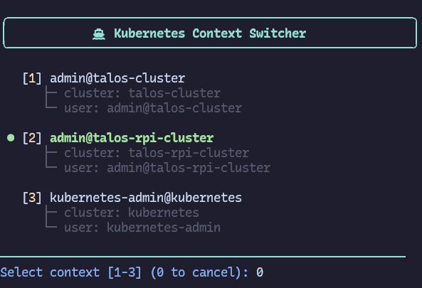

# kc - Kubernetes Context Switcher

An interactive command-line tool for switching between Kubernetes contexts and namespaces.


[](https://go.dev/)
[](https://opensource.org/licenses/MIT)

## ✨ Features

- 🎨 **Colorful Interface** - Easy-to-read, color-coded output using ANSI colors
- ⚡ **Fast & Lightweight** - Minimal dependencies, single binary
- 📋 **Detailed View** - See cluster and user information for each context
- 🎯 **Current Context Highlight** - Clearly shows your active context
- 🔄 **Interactive Selection** - Number-based selection for quick switching
- 🚫 **Zero Dependencies** - Only uses standard Go libraries and YAML parser

## 📸 Demo



## 🚀 Quick Start

```bash

# Install from source
git clone https://github.com/yourusername/kc.git
cd kc
make install
```

Then simply run:
```bash
kc
```

## 📦 Installation

### Prerequisites

- Go 1.19 or higher (for building from source)

### Option 1: Build from Source

```bash
git clone https://github.com/debelio/kc.git
cd kc
go build -o bin/kc main.go
```

### Option 2: Using Make

```bash
# Build standard binary
make build

# Build optimized binary (smaller size)
make build-small

# Install to /usr/local/bin (requires sudo)
make install

# Uninstall from /usr/local/bin
make uninstall
```

### Configuration

The tool reads from your kubeconfig:
- **Default location**: `~/.kube/config`
- **Custom location**: Set `KUBECONFIG` environment variable

```bash
# Use custom kubeconfig
export KUBECONFIG=/path/to/your/kubeconfig
kc
```

## 🚀 Usage

### Interactive Mode

Simply run `kc` without arguments to enter interactive mode:

```bash
kc
```

### Non-Interactive Mode

You can also pass arguments directly for quick context/namespace switching:

```bash
# Switch to a context
kc prod-cluster

# Switch to a context and set namespace
kc prod-cluster my-namespace

# Using flags (alternative syntax)
kc -c prod-cluster
kc -c prod-cluster -n my-namespace

# Partial context name matching
kc prod        # Matches "prod-cluster" if it's the only match
```

### Command-Line Options

```
-c string
    Context name to switch to
-n string
    Namespace to set (requires -c)
```

## 🔧 Development

### Building

```bash
# Standard build
go build -o bin/kc main.go

# Optimized build (smaller binary, ~30-50% size reduction)
go build -ldflags="-s -w" -o bin/kc main.go
```

### Make Targets

```bash
make build        # Build the binary
make build-small  # Build optimized binary (smaller size)
make clean        # Remove build artifacts
make install      # Install to /usr/local/bin
make uninstall    # Remove from /usr/local/bin
make run          # Build and run the application
make help         # Show available commands
```

## 🛠️ How It Works

1. **Read** kubeconfig from `~/.kube/config` or `$KUBECONFIG`
2. **Parse** YAML to extract contexts, clusters, and users
3. **Display** all contexts with highlighting for the current one
4. **Prompt** user for selection via numbered input
5. **Update** `current-context` field in kubeconfig
6. **Write** updated configuration back to file

## 📋 Dependencies

- [gopkg.in/yaml.v3](https://gopkg.in/yaml.v3) - YAML parsing

**Note:** Uses built-in ANSI color codes for styling—no additional color libraries needed!

## 📄 License

This project is licensed under the MIT License - see the [LICENSE](LICENSE) file for details.

## 🌟 Similar Projects

- [kubectx](https://github.com/ahmetb/kubectx) - The original Kubernetes context switcher (bash/shell)
- [kubie](https://github.com/sbstp/kubie) - An alternative context manager (Rust)
- [kubens](https://github.com/ahmetb/kubectx) - Namespace switcher companion to kubectx

## 🙏 Acknowledgments

- Inspired by [kubectx](https://github.com/ahmetb/kubectx)
